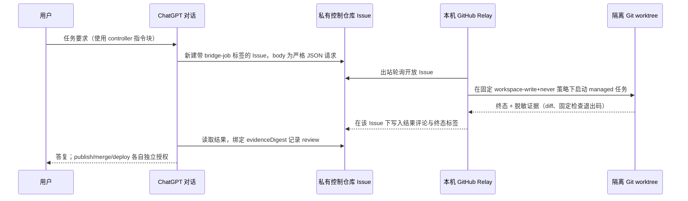

# ChatGPT Codex Bridge 中文说明

> 让 ChatGPT 网页对话通过 **GitHub Relay V1** 调度你自己 Mac 上的 Codex：
> 本机出站轮询你在 GitHub 上的**私有控制仓库**里的标签 Issue，把它变成
> 受 Guard 约束、可审阅的 Codex 任务。legacy Secure MCP Tunnel 传输仍然
> 保留，但它不是 GitHub Relay 的依赖。

本项目来源于 [larryppgg/chatgpt-codex-bridge](https://github.com/larryppgg/chatgpt-codex-bridge)
（MIT，Copyright (c) 2026 larryppgg）。本发行在上游 Bridge 之上增加
GitHub Relay 多项目管理能力。这是 MIT 社区项目，不是 OpenAI 官方产品，
也不提供 ChatGPT、Codex、GitHub、Tunnel 或设备凭据。

## 先回答最重要的问题

**不会因为别人打开或克隆这个仓库，就能直接控制你家里的电脑。**

仓库只包含源代码、安装脚本、Skill、测试和说明，不包含以下任何一项：

- 你的私有控制仓库及其 Issue 权限；
- 你的 GitHub / ChatGPT / Codex 授权；
- 本机能力签名密钥（capability key）；
- 本机 registry、journal、原始 thread/job ID；
- Tunnel profile、浏览器 Cookie、SSH key、Keychain 或生产环境变量。

要让你的 ChatGPT 对话真正驱动这台 Mac，必须同时满足：


缺少任何一环，都不能从仓库远程控制电脑。即使仓库公开，其他人也只获得
源代码；他们必须在自己的设备上完成自己的安装、授权和控制仓库配置。

## 它实际怎么工作



新项目/新仓库由你先用 `managed-repos.zsh register` 注册并 `verify`；
Relay 绝不接受来自网页请求的路径、分支、remote 或仓库名。managed 任务
在独立 Git worktree 中运行；publish 只产生生成分支，永不 merge 或部署。

## Quick Start（GitHub Relay V1）

> **候选说明：** 拟定公开仓库 `younger404/chatgpt-codex-bridge` 与拟定
> tag `v1.0.0-beta.1` 目前**尚未创建**。下列获取命令只有在 beta 实际
> 发布后才能执行；届时请再次核对仓库与 tag 的真实存在性。

前置条件：macOS；Git；Python 3；已认证的 GitHub CLI（`gh`）；可用的
Codex。已有回执记录测试过 Codex `0.153.4` 与 gh `2.89.0`——这只说明
"测过什么"，不承诺所有版本兼容。

### 0. 获取源码并确定工作根目录

主路线——clone 带 tag 的发行版（存在之后），并始终在**仓库根目录**下
执行命令；下文所有 `plugins/...` 路径都以该目录为当前目录：

```zsh
git clone --branch v1.0.0-beta.1 --depth 1 \
  https://github.com/younger404/chatgpt-codex-bridge.git
cd chatgpt-codex-bridge
```

marketplace 路线——`codex plugin marketplace add younger404/chatgpt-codex-bridge
--ref v1.0.0-beta.1` 然后 `codex plugin add chatgpt-codex-bridge@chatgpt-codex-bridge`
安装的是同一份包，但此时你的工作根目录是**已安装插件根目录**，同样的
脚本直接位于其 `scripts/` 下（而不是 `plugins/chatgpt-codex-bridge/` 下）。
两种路径布局不要混用。

### 1. 准备你自己的控制仓库与 sample

自己在 GitHub 上创建一个空的**私有控制仓库**（例如
`你/bridge-control-private`）。你必须能在其中读取和创建带标签的
Issue。本开源仓库绝不兼任公共执行控制仓。

注册并校验一个 sample 仓库（先用你自己的合成 sample；它需要匹配的
GitHub `origin` 和受保护的 base 分支）。从仓库根目录：

```zsh
/bin/zsh plugins/chatgpt-codex-bridge/scripts/managed-repos.zsh register \
  --alias sample-repo \
  --repo-path /绝对路径/规范仓库 \
  --repository-full-name 你/sample-repo \
  --base-remote origin \
  --base-branch main
/bin/zsh plugins/chatgpt-codex-bridge/scripts/managed-repos.zsh verify sample-repo
```

注册不等于启用 GitHub 传输。

### 2. 路线 A——正常新安装（默认模式）

当你确实要让 Relay 运行时选这条。安装器是 **fresh-only**：任何既有
Bridge config、store、key、journal、runtime 或 service 文件都会让它以
`FRESH_INSTALL_REQUIRED` 停止（绝不接管或修复既有状态）。

默认模式有真实副作用——运行前先确认：

- 会执行必需的 Codex `workspace-write + never` 支持探测，它会调用
  Codex 并可能执行一次模型回合；
- 会检查你的 GitHub CLI 认证；
- 会写入全新的 config、job store、capability key 和 LaunchAgent plist；
- 会显式 enable 并 bootstrap Relay 服务（plist 本身始终默认
  `Disabled=true`；激活失败会对同一 label 做 best-effort disable）。

```zsh
/bin/zsh plugins/chatgpt-codex-bridge/scripts/install-github-relay-v1-macos.zsh \
  --workspace /绝对路径/bridge-workspace \
  --codex-bin /绝对路径/codex \
  --control-repository 你/bridge-control-private \
  --allowed-author 你的GitHub登录名 \
  --enable-alias sample-repo
```

预期成功输出：`GITHUB_RELAY_V1_STARTED POLICY_SUPPORT=PASS`。

然后按
[docs/runbooks/verify-installation.md](docs/runbooks/verify-installation.md)
做只读 readiness 核对：服务 label/argv、生成的 config、store validator、
服务状态与 journal 状态。它们都是只读的；没有任何一步会打印
`BRIDGE_V1_READY`。

### 3. 路线 B——仅离线评估（`--no-start`）

只在你想查看安装器会生成什么、而不调用任何 Codex、GitHub 或 launchctl、
也不创建 journal 时选这条：

```zsh
/bin/zsh plugins/chatgpt-codex-bridge/scripts/install-github-relay-v1-macos.zsh \
  --workspace /绝对路径/bridge-workspace \
  --codex-bin /绝对路径/codex \
  --control-repository 你/bridge-control-private \
  --allowed-author 你的GitHub登录名 \
  --enable-alias sample-repo \
  --no-start
```

预期输出：`GITHUB_RELAY_V1_CONFIGURED POLICY_SUPPORT=NOT_PROBED
PLIST_DEFAULT_DISABLED=true LAUNCHD_STATE=NOT_PROBED
SERVICE_STARTED_BY_INSTALLER=false`。

**`--no-start` 是终点，不是两步中的第一步。** 它留下的是已配置但未
验证、未启动的安装；fresh-only 安装器会拒绝在该状态上再次运行
（`FRESH_INSTALL_REQUIRED`），因此不存在"去掉 `--no-start` 再装一遍即
可激活"的支持路径。评估后要真正运行 Relay：有意清除评估状态（或改用
另一个全新 HOME/workspace），从头走路线 A。

### 4. 从 ChatGPT 驱动任务

使用
[docs/runbooks/github-relay-v1-controller.md](docs/runbooks/github-relay-v1-controller.md)
中的能力预检和可复制的 controller 指令块。协议请求是**新建**的带
`bridge-job` 标签 Issue 的 **body**；Relay 把结果以评论写回该 Issue。
普通评论不是协议请求。

## ChatGPT 端能力是独立前提

安装这份源码**不等于**给你的 ChatGPT/GitHub/Codex 账号授予任何能力；
能读取 GitHub 源码也**不等于**能创建带标签的控制 Issue。网页 controller
路径只有在你的会话对你的私有控制仓库**实际提供** GitHub 写工具（创建
带标签 Issue、读取 Issue 与评论）时才成立。OpenAI 的帮助文档把 GitHub
读取型 app 明确标注为 read-only，而 GitHub plugin 页面另列 Write
capability——以你对话里实际可见的工具为准。不能凭套餐名称、GitHub 已
连接或 Skill 已安装就推断写入可用。如果你的会话只有 read-only，就不
具备网页自动投递条件；不要为了绕过它而降低产品安全边界。

## legacy：Secure MCP Tunnel

上游 Secure MCP Tunnel 传输（`personal-full-control` / `workspace-safe`
预设、`codex-start` / `codex-wait`、Apps 卡片恢复）仍然实现并保留回归
测试，作为 legacy 传输文档化在
[docs/runbooks/secure-mcp-tunnel.md](docs/runbooks/secure-mcp-tunnel.md)
和 [docs/runbooks/portable-plugin.md](docs/runbooks/portable-plugin.md)。
它不是 GitHub Relay V1 的依赖。Tunnel 的 `install-macos.zsh` 会以
`EXPLICIT_STORE_REQUIRES_REVIEWED_RECOVERY` 拒绝 managed 存储；Tunnel 的
stop/uninstall 只作用于 Tunnel 服务，不是 GitHub Relay 的通用命令。

## 状态、隐私与已知限制

- registry 变更会使旧 managed capability 失效；registered 不等于
  enabled；活动任务中不要无提示更改作用域。
- 新 relay journal 不得指向带历史可消费请求的控制仓库；不默认迁移旧
  journal/key。
- `completed`、结果已投递、review accepted、publish、merge、deploy 是
  不同状态。`checksState=WITHHELD` 不是"测试通过"；已有固定检查事件只
  是历史证据，不是你跑出来的退出码。
- "同一 worktree/线程"只按已验收路径声明；不声称任意网络故障下的
  exactly-once，也不声称多租户隔离。
- 控制仓库会保存任务请求和脱敏后的代码差异。请按你的项目数据政策使用；
  本项目不宣称数据从不出本机。
- capability key、registry、journal、token 不进入 Git，也不要贴进公开
  Issue；配置日志只提供脱敏元数据。
- 人工隔离测试 HOME 位于 `/tmp`/`$TMPDIR` 会影响 outside-marker 判据；
  这是复现指引，不修改 sandbox 设置。
- token 投影、`--insecure-storage`、直接写 hosts.yml 都不是普通安装
  步骤。
- 当前只支持 macOS LaunchAgent；Windows/Linux 服务封装未实现。
- 本项目不绕过套餐/账号权限，也不是 OpenAI 官方产品。

## 常见坑（通用化记录）

1. **`queued/running` 不是完成。** 必须等待终态并审阅证据。
2. **看到 Issue 不等于任务被接收。** 以 relay 实际 admission 与 journal
   记录为准。
3. **review 绑定的是 exact evidence。** 新证据即使沿用旧引用也视为未
   审阅。
4. **publish 不随 review 自动发生。** 它是独立授权操作，且只推送生成
   分支。
5. **"当前目录脱敏"不等于"Git 历史脱敏"。** 公开发行采用全新干净历史，
   不把私有历史当作已脱敏。

## 文档导航

- 安装/升级/回滚 SOP：
  [skills 参考](plugins/chatgpt-codex-bridge/skills/chatgpt-codex-controller/references/install-upgrade-macos.md)
- 网页 controller SOP（能力预检、指令块）：
  [docs/runbooks/github-relay-v1-controller.md](docs/runbooks/github-relay-v1-controller.md)
- 验证 SOP：[docs/runbooks/verify-installation.md](docs/runbooks/verify-installation.md)
- managed 仓库：[docs/runbooks/managed-existing-repo.md](docs/runbooks/managed-existing-repo.md)
- Relay 协议：[docs/runbooks/relay-component-02.md](docs/runbooks/relay-component-02.md)
- 合成任务示例：[examples/](examples/README.md)
- 安全政策：[SECURITY.md](SECURITY.md) · 贡献：[CONTRIBUTING.md](CONTRIBUTING.md)
- spec 在 `docs/specs/`；决策在 `docs/adr/`。

## 验证

```zsh
/bin/zsh tests/portable/test-plugin-package.zsh
/bin/zsh tests/portable/test-public-sanitization.zsh
/bin/zsh tests/portable/test-github-relay-v1-install.zsh
/bin/zsh tests/portable/test-readme-demo.zsh
/bin/zsh tests/portable/test-macos-installer.zsh
```

## 许可证

MIT。见 [LICENSE](LICENSE)。上游 Copyright (c) 2026 larryppgg；本发行
由 younger404 维护。第三方组件保留各自 notice 与许可证。
