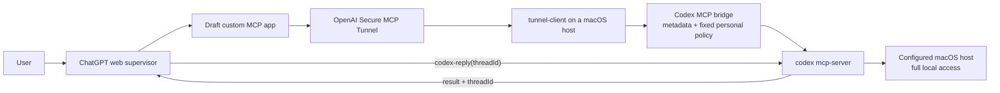
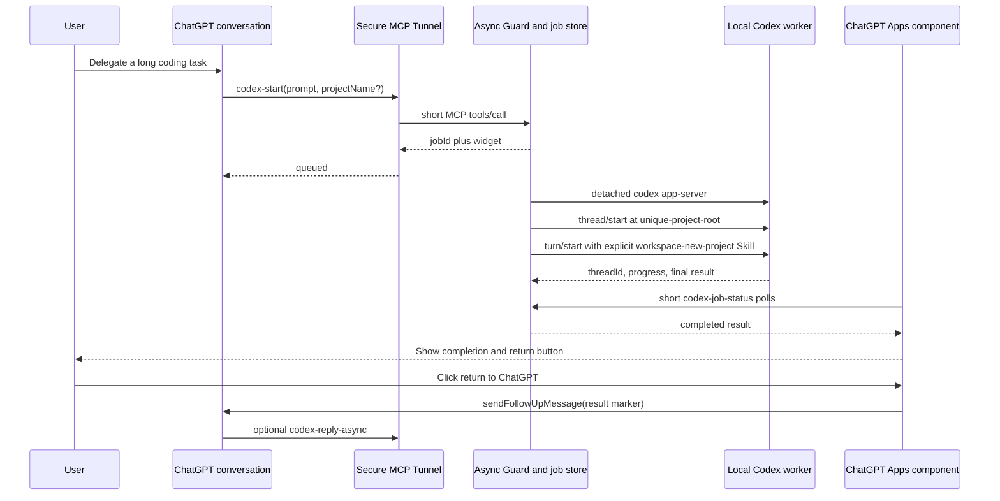

# ChatGPT–Codex Bridge Design

Status: Active; T-413 canonical desktop project grouping complete
Date: 2026-08-21
Spec ID: `chatgpt-codex-bridge`

## 1. Design Summary

The design reuses OpenAI's official Codex CLI, ChatGPT Apps component runtime,
MCP, and Secure MCP Tunnel. Short tasks retain the proven direct synchronous
controller-to-agent link. Long tasks use a local durable job facade: the MCP
call returns a job handle quickly, Codex runs outside that request, and an
in-conversation component presents the completed result and posts it back into
the same ChatGPT conversation after one explicit click. It does not introduce
CanEngine, Workspace Agent, a cloud relay,
an approval service, or browser DOM automation on the primary path.

The result is more accurately described as a controller agent calling a stateful Codex agent facade over MCP, not as a peer-to-peer agent mesh.

Current applicability is determined per device and per conversation: Developer Mode, a connected Secure Tunnel app, truthful action tools, and the configured fixed policy must all be present. A fresh conversation with the app visibly attached can call `codex`, retain the visible thread tag, and call `codex-reply` against the same thread. A normal or stale conversation without the app attachment has no Codex tool to call.

### Durable long-task path

The model is not held open while Codex works. The component is the supported
same-conversation return mechanism. Live testing proved ChatGPT web does not
create a new turn from a background component call even when the API Promise
resolves, so one user click is the honest final handoff. If the page is closed,
the local job still finishes and the component resumes polling when the
conversation is rendered again. This is deferred delivery, not unsolicited
push into an inactive consumer conversation.

## 2. Options Considered

### Option A — Raw official direct path (transport proven; draft persistence failed)

`ChatGPT web -> Secure MCP Tunnel -> codex mcp-server`

Benefits:

- smallest architecture that exercises the required Codex thread primitive;
- official components and documented schemas;
- outbound-only tunnel; no public inbound listener;
- explicit `codex` and `codex-reply` tools.

Costs and limits:

- account/workspace availability gate;
- raw tool arguments include unsafe choices such as `danger-full-access` and `approval-policy=never`;
- synchronous request lifecycle is not durable asynchronous job orchestration;
- current macOS restricted-sandbox behavior needs an explicit smoke test.

### Option B — Guarded official path (implemented locally)

`ChatGPT web -> Secure MCP Tunnel -> narrow stdio guard -> codex mcp-server`

Benefits:

- keeps the official Codex agent and Tunnel transport;
- adds the complete, truthful safety annotations required by ChatGPT plugin metadata;
- removes raw policy parameters from the public schema and injects the user's fixed full-control policy server-side;
- preserves contract validation and protocol correctness without adding an approval workflow.

Costs and limits:

- adds a small locally maintained compatibility component;
- does not change the ChatGPT workspace's legitimate action entitlement;
- uses a configured starting directory but intentionally does not treat it as a filesystem boundary;
- must transparently forward JSON-RPC notifications without corrupting stdout.

### Option C — CanEngine first

Benefits: proven by the supplied article for generic local file/command loops and visual/local workflows.

Not selected as the first direct path because it does not itself prove a Codex thread, `threadId`, or Codex-to-supervisor correction loop. It is now the explicit consumer-workspace fallback: if direct full MCP is unavailable, test whether a bounded CanEngine command surface can launch and continue Codex without misrepresenting tool permissions or exposing a broad desktop boundary.

### Option D — Custom MCP facade over Codex App Server

Benefits: richer thread, turn, event, steer, interrupt, review, approval, and history surfaces.

Deferred because ChatGPT does not directly speak the App Server protocol. This option requires a custom MCP-to-App-Server adapter and substantially increases state, approval, recovery, and protocol-mapping complexity.

## 3. Component Responsibilities

### ChatGPT web supervisor

- interprets the user's goal;
- invokes `codex(prompt)` once when the conversation needs a new Codex thread;
- reviews the returned result and `threadId`;
- records the returned value as `Codex thread: <threadId>` in the assistant response so it persists in that web conversation;
- invokes `codex-reply(prompt, threadId)` for every later instruction in the same conversation.

### Secure MCP Tunnel

- provides outbound HTTPS transport from the configured macOS host;
- forwards MCP JSON-RPC between the OpenAI-hosted endpoint and local stdio server;
- does not provide task durability, permission enforcement, or reverse wake-up semantics.

### tunnel-client

- runs inside the same trust boundary as the local Codex MCP process;
- launches the MCP command using an explicit executable path;
- exposes health/readiness surfaces and supports immediate revocation by process stop;
- stores credentials outside the repository.

### Codex MCP Server

- provides `codex` to start a Codex conversation;
- returns `structuredContent.threadId` with the result;
- provides `codex-reply` to continue the same thread;
- remains an official raw interface during proof only.

### Codex MCP guard

- exposes the reviewed synchronous pair plus the durable async start/reply and
  app-only status tools on the personal full-control preset;
- supplies `readOnlyHint=false`, `destructiveHint=true`, `idempotentHint=false`, and `openWorldHint=true` for both tools;
- exposes prompt-only `codex(prompt)` and strict `codex-reply(prompt, threadId)` schemas;
- describes `codex` as the once-per-web-conversation start tool, requires a compact visible thread tag, and describes `codex-reply` as the same-thread continuation tool;
- injects the configured starting real path, `sandbox=danger-full-access`, and `approval-policy=never`;
- accepts a conversation-carried thread ID without requiring the current guard process to have observed its creation, while checking the downstream reply preserves that identity;
- leaves model and reasoning configuration to the operator's normal Codex defaults;
- filters the child environment so Tunnel credentials and unrelated secret-bearing variables are not inherited;
- forwards child notifications while keeping stdout reserved for MCP JSON-RPC.
- reconstructs successful public tool results from the reviewed `threadId` and `content` fields only, rather than forwarding downstream diagnostic fields or metadata;
- runs with macOS system Python as `codex-mcp-guard.py --workspace <starting-real-path> --codex-bin <exact-real-executable>`;
- suppresses child stderr and emits only generic guard diagnostics so MCP stdout remains JSON-only and local identifiers are not copied into Tunnel logs.
- pins the complete reviewed downstream input/output schemas while ignoring description-only changes, so additive raw controls fail closed;
- requires client and child in-flight request IDs to be globally disjoint and accepts a client response only for a child request the guard actually forwarded.
- forwards the first `initialize` request to Codex, caches a successful result, replays it for additional Tunnel callers with their own request IDs, and forwards the initialized notification only once.
- before completing that first client initialization, forwards the initialized notification and validates the raw downstream `tools/list`; this lets a cached app issue its first `tools/call` safely without a client-side list request on the restarted stdio process.
- rejects client `tools/list` and `tools/call` requests until initialization and the internal downstream contract check have completed, and ignores a premature client initialized notification instead of forwarding it out of lifecycle order.
- does not attempt to extend the Tunnel deadline locally: the control plane supplies that deadline and progress notifications do not renew it. Long work is moved to the durable job facade rather than hidden behind a larger client-side timeout.

### Durable job facade and worker

- `codex-start(prompt, projectName?)` creates a collision-safe child directory
  below the configured workspace container, then creates a UUID-addressed job
  and returns immediately;
- every new-project turn carries the installed `workspace-new-project` Skill
  as an App Server Skill input item and begins its text with a bridge-owned
  `$workspace-new-project --here` bootstrap contract;
- the detached worker registers the exact child root with the Codex desktop
  bundle, starts a one-job App Server client, calls `project/create` with a
  Job-derived idempotency key, creates an interactive thread with
  `thread/start(projectId=...)`, and submits `turn/start` at that root;
- after the first turn is durable and terminal, the worker verifies
  `project/list` and `thread/list(projectId)`. Desktop live acceptance then
  confirms the task reconciles to the separately saved desktop project ID. A
  persistently null desktop `projectId` is a failure;
- after a zero-exit new-project turn, the worker checks the required Skill
  scaffold and records an explicit failure if it is incomplete;
- `codex-reply-async(prompt, threadId)` resolves the original project root and
  project ID from private durable job records, resumes the App Server thread in
  that same directory and project, and starts a new turn; a legacy thread
  without a recorded root falls back to the configured container;
- job state is stored below the configured user Application Support directory,
  never in the repository;
- a detached worker runs `codex app-server --listen stdio://` and speaks the
  versioned JSONL `initialize`, `thread/start|resume`, and `turn/start` protocol with
  the server-side personal policy and records the first thread-start event,
  last agent message, exit status, and timestamps atomically;
- `codex-job-status(jobId)` is a short read-only app-visible tool and never waits
  for Codex;
- `codex-wait(jobId)` is a model-visible, read-only bounded join. It long-polls
  the same durable state for a fixed host interval, returns immediately on a
  terminal state, and otherwise tells ChatGPT to call it again without ending
  the user-facing turn;
- `codex-job-open(jobId)` is a model-visible, read-only recovery tool that
  renders the component for the same durable job without enqueueing work;
- a stale `running` job whose recorded process no longer exists is surfaced as
  `interrupted`;
- the synchronous `codex` and `codex-reply` tools remain available for bounded
  diagnostics and compatibility, but their descriptions route normal project
  work to the async tools.

### Same-conversation Apps component

The async tool descriptors reference a versioned `ui://` resource using the MCP
Apps `ui.resourceUri` field and ChatGPT compatibility alias
`openai/outputTemplate`. The self-contained component reads the initial
`jobId`, calls the app-only status tool, and persists widget state after
meaningful changes. Once the job is terminal, it displays a single
`把结果发给 ChatGPT 审查` control. That user activation calls
`window.openai.sendFollowUpMessage`. The posted message contains a deterministic
`[codex-job:<jobId>]` marker, status, thread identity when available, and the
bounded final Codex response.

ChatGPT stores the app/template snapshot associated with each historical tool
result. Refreshing the installed app updates later calls but does not rewrite an
already-failed card. `codex-job-open(jobId)` therefore creates a new rendered
tool result for the same durable job after refresh; it does not duplicate the
Codex execution.

This path was chosen over browser DOM injection because it uses the host's
documented component APIs and does not depend on ChatGPT composer selectors.
The one-click boundary is intentional: a zero-gesture call was observed to
resolve without creating a server-side conversation message, whereas clicking
the component control created the new turn and exact ChatGPT response.
DOM injection remains a separate fallback for a host that lacks Apps component
support. MCP Tasks remain capability-gated because host support varies and both
client and server must explicitly opt in.

### Same-turn ChatGPT supervisory join

The preferred active-conversation path is a bounded model tool loop:

1. `codex-start` or `codex-reply-async` creates the durable job and returns its
   `jobId` immediately.
2. ChatGPT calls `codex-wait(jobId)`. The Guard checks the existing job for up
   to a fixed interval shorter than one Tunnel request window; the caller cannot
   select or enlarge that interval.
3. If the state is still `queued` or `running`, the result explicitly requires
   another `codex-wait` call and forbids a premature completion answer.
4. On `completed`, ChatGPT reviews `content` and `threadId`. If the user's full
   acceptance target remains incomplete, it calls `codex-reply-async` on that
   exact thread and joins the resulting job in the same way.
5. The model answers the user only after completion, a material input request,
   or a truthful terminal failure.

This adapts the existing durable JobStore rather than building another relay.
It also avoids one monolithic synchronous Codex call, whose lifetime previously
crossed Tunnel request limits. The current Guard is a serialized stdio server,
so one bounded wait temporarily serializes other Guard requests; that tradeoff
is accepted for this single-user macOS host and is capped below 60 seconds.

MCP Tasks are the protocol-native future replacement, but they require explicit
client capability negotiation. The observed ChatGPT/Tunnel initialization uses
the older compatibility path and has not declared task support, so the Guard
must not emit task-shaped results yet. The Apps polling card remains the durable
recovery path when the active model loop is no longer running.

### Root-turn event scoping

The App Server worker records the root `threadId` and `turnId` returned by its
own `thread/start|resume` and `turn/start` calls. Only `item/completed` and
`turn/completed` events matching both identities may update the stored final
answer or terminal state. Events from delegated reviewers or other turns may
advance observability timestamps, but they cannot terminate the durable job.

This identity filter is required because one App Server event stream can carry
events for delegated Codex threads. Treating the first `turn/completed` event
as the root terminal would truncate the parent workflow and return a child
review as if it were the requested result.

### Apps result hydration

The component treats initial ChatGPT globals as an optimization, not a mount
precondition. It unwraps `toolOutput` first, falls back to the canonical full
result envelope in `toolResponseMetadata`, and then listens for both
`openai:set_globals` and MCP Apps `ui/notifications/tool-result` hydration.
The first valid result owns the durable `jobId`; hydration only reads or polls
that job and cannot enqueue another Codex task.

ChatGPT conversations retain the tool descriptor and template URI that existed
when the conversation loaded the plugin. A widget revision therefore advertises
one new immutable URI while the resource reader keeps the immediately preceding
URI as a compatibility alias. Both URIs return the current backward-compatible
HTML, but discovery lists only the new URI. This lets an old conversation recover
without pinning new conversations to stale metadata.

### Single-user host boundary

The `personal-full-control` preset deliberately uses the authority of the configured macOS account. The configured workspace is only the Codex starting directory, not a containment boundary. Tunnel credentials stay in Keychain and are filtered from the child environment.

### Persistent Tunnel runtime

The portable deployment uses one parameterized user LaunchAgent as the process supervisor. Its `ProgramArguments` call the selected absolute `tunnel-client` binary with `run --profile <tunnel-profile>`. The external profile remains the single source of Tunnel identity and credential-file reference; explicit non-secret CLI arguments select the staged Guard, unattended starting workspace, Codex binary, and stable health state.

The LaunchAgent uses `RunAtLoad=true` for login startup and `KeepAlive=true` for crash recovery. It supplies only non-secret runtime environment such as `HOME` and a minimal `PATH`. Because profile values can take precedence over environment variables, the resolved health listener and stable URL file are fixed with explicit `--health.listen-addr 127.0.0.1:0` and `--health.url-file` command arguments. Logs and runtime health state live below the user's `Library` directories, not inside Git. A small versioned service command installs, restarts, stops, and inspects the exact user job; it does not wrap or duplicate Tunnel polling. Readiness requires `/healthz`, `/readyz`, and a recent `commands_poll_last_successful_timestamp_seconds` value from `/metrics`, because a live recovery test showed that local HTTP 200 can briefly coexist with Control Plane EOF retries. The startup-only metadata fetch is not used as the connection signal: it may fail once while the long poll subsequently recovers and continues returning 204.

The LaunchAgent working directory is its stable Application Support state directory. It MUST NOT use `~/Documents/chatgpt-code`: live process sampling showed an uninteractive LaunchAgent can block in `getcwd` while resolving a macOS privacy-protected Documents path. All Tunnel and profile inputs are absolute, so changing this incidental working directory does not change the MCP target.

The same TCC boundary applies to loading the Guard source from `~/Documents`. During `install` and `restart`, the management command copies the reviewed Guard to `~/.local/share/chatgpt-codex-bridge/` with mode 700. This path is both outside protected Documents and free of spaces; a live attempt under `Application Support` proved the Tunnel stdio command parser split the path and Python exited with status 2. The LaunchAgent supplies one `--mcp.command` override pointing at the no-space runtime copy and `/Users/example-user/codex-workspace`; it does not rewrite the Tunnel profile or its identity/credential fields. This workspace is the intended container for `workspace-new-project` and avoids requiring unattended Full Disk Access merely to start the tool chain.

Rollback is `launchctl bootout gui/<uid>/<launch-agent-label>`. The plist remains installed for the next login unless explicitly removed, so temporary revocation and permanent uninstall stay distinct operations.

## 4. Data and Control Flow

### Initial call

1. The user gives ChatGPT a new-project task in a web conversation.
2. ChatGPT invokes `codex-start(prompt, projectName?)`; the bridge creates a
   unique child project root locally and never accepts a caller-supplied path.
3. The bridge opens that root with the Codex desktop bundle in background mode,
   calls `project/create`, then starts an App Server interactive thread at
   `<project-root>` using the returned App Server `projectId` and fixed
   `danger-full-access` plus no-approval policy.
4. The bridge sends a first turn containing both the explicit
   `workspace-new-project` Skill item and the mandatory
   `$workspace-new-project --here` text contract. Codex performs the requested
   work, and returns events containing its thread identity and result.
5. After the first root turn is durable and terminal, the worker validates
   project listing, thread listing, exact root/project assignment, and the
   scaffold, then records the association for later ChatGPT review and
   continuation. The desktop app reconciles the durable task to its separately
   saved project identity by exact root.
6. While the ChatGPT turn remains active, ChatGPT repeatedly calls
   `codex-wait(jobId)` until the start job is terminal.
7. ChatGPT reviews the result against the user's full project acceptance target.

### Corrective call

1. ChatGPT reviews the first result.
2. ChatGPT invokes `codex-reply-async` using the exact returned `threadId`.
3. The bridge resolves the project root and project ID from private job state,
   calls App Server `thread/resume` with that root, verifies the persisted
   project assignment, and submits the corrective `turn/start` without
   reinvoking the new-project Skill.
4. Codex continues the same conversation in the same project directory and
   returns the corrected result.
5. ChatGPT joins the new job through `codex-wait`, reviews it, and repeats this
   same-thread cycle until the requested work is complete or genuinely blocked.

### Revocation

1. Stop `tunnel-client`.
2. Stop the local Codex MCP process if it remains alive.
3. Verify readiness is false/disconnected.
4. Confirm the next remote tool call fails closed.

## 5. Security Model

### Trust boundaries

| Boundary | Trusted for | Not trusted for |
|---|---|---|
| ChatGPT supervisor | task decomposition and review | enforcing local filesystem scope |
| Secure MCP Tunnel | private transport | authorization inside Codex arguments |
| Raw Codex MCP | executing documented tool calls | preventing the caller from selecting unsafe documented values |
| Codex MCP guard | metadata compatibility and local argument policy | replacing the OS sandbox or granting ChatGPT entitlement |
| Configured macOS account | convenient local execution and Keychain access | limiting the bridge to the intended workspace by itself |
| Approved Git workspace | task data and expected diffs | instructions that override system policy |

### Fixed mechanics

- do not expose or forward unrelated credentials, SSH agents, browser cookies, or production `.env` values to the Codex child;
- keep the Tunnel runtime key in macOS Keychain and out of the repository, logs, and reports;
- no raw tokens, IDs, endpoints, or credentials in versioned files, logs, memory, or screenshots.

### Current personal-workspace policy

The implemented guard is the enforcement layer for this project:

- exact real starting path after symlink resolution;
- fixed `danger-full-access` sandbox and `never` approval policy;
- no public mode selector, approval queue, or local write-enable flag;
- positive child-environment allowlist;
- normal Git branches and milestone commits for recoverability when applicable;
- redacted evidence without raw credentials or connector identifiers.

## 6. Failure Modes and Recovery

| Failure | Detection | Recovery | Forbidden workaround |
|---|---|---|---|
| ChatGPT lacks full MCP write | missing plan/UI/action capability | stop or perform read/fetch-only research | claiming write support from docs alone |
| Tunnel association fails | tunnel absent in ChatGPT picker | verify workspace/org association and RBAC | public unauthenticated endpoint |
| Default Codex path fails | `ENOENT` from Homebrew wrapper | use verified explicit binary; later repair separately | silently relying on PATH order |
| Full-control policy is not propagated | downstream arguments or live behavior differ | stop the bridge and repair the fixed policy | adding a user-facing approval workflow |
| Old conversation continues after bridge restart | `codex-reply` receives a persisted thread ID | forward it and verify returned identity | requiring a process-local thread registry |
| Mac sleeps or tunnel disconnects | readiness/health failure | wake/reconnect and start a fresh bounded call | describing it as durable background work |
| Local health is 200 while Control Plane is reconnecting | latest successful-poll metric is absent or stale | keep waiting; let the built-in poller recover, then restart once only after independent network/doctor checks | reporting the service ready from local health alone |
| Tool schema changes | ChatGPT call/schema error | refresh the draft app tool snapshot and rerun contract tests | ignoring metadata drift |
| App not attached to the ChatGPT conversation | composer lacks the `Codex MCP Guard` pill and the model reports no callable Codex tool | open the app detail, choose `在聊天中试用`, and verify the pill before sending the first prompt | treating a healthy Tunnel as broken or retrying inside the unattached conversation |
| Missing/false annotations | draft app fails or unsafe confirmation framing | stop; correct metadata truthfully and rescan | marking Codex as read-only |
| Guard/child protocol drift | unexpected tool list, invalid JSON, or child exit | terminate the guarded session and preserve redacted diagnostics | passing unknown tools through |
| Unexpected file/network access | diff/hash/log mismatch | stop tunnel, preserve evidence, investigate | retrying on a real repo |
| Unsafe or duplicate project display name | local normalization or atomic `mkdir` collision | use a safe name or deterministic numeric suffix under the configured container | accepting a caller-supplied `cwd` |
| Project API unavailable or mismatched | `project/create`, `project/list`, or thread `projectId` validation fails | fail the durable job and preserve the directory/project for diagnosis | falling back to `cwd`-only task visibility |
| Codex skips the new-project Skill | required scaffold absent after a zero-exit run | mark the durable job failed and keep the project directory for diagnosis | reporting successful initialization from prose alone |
| Historical task is grouped under the container | task has the wrong project assignment or `projectId=null` | use official `project/import` for the selected existing root/thread IDs | editing Codex session JSON, SQLite, or indexes |

Custom-MCP action registration, fixed-policy propagation, filesystem write behavior, and same-conversation thread continuity are covered by the cited acceptance tasks. Repeatability still requires fresh end-to-end validation on each installed device.

## 7. Observability

The pilot produces a redacted run record containing:

- UTC/local timestamp;
- Codex version and resolved executable label, not credential paths beyond the approved command;
- tunnel-client version and health state;
- account eligibility result without IDs;
- MCP tool names/schema hash;
- Git baseline and final status;
- expected versus actual changed paths;
- fixed policy propagation outcome;
- thread continuity boolean, not raw `threadId`;
- final classification: `PASS`, `FAIL_CLOSED`, or `UNVERIFIED`.

## 8. Test Strategy

### Contract tests

- MCP initialize and `tools/list` succeed.
- `codex` requires a prompt and accepts the documented safe fields.
- The current `codex-reply` JSON schema requires `prompt`, exposes `threadId`, and keeps `threadId` schema-optional for backward compatibility with the deprecated `conversationId` alias.
- All new bridge calls supply `threadId`; missing both `threadId` and `conversationId` is tested as an invalid semantic call.
- Raw-proof checks demonstrate observed behavior only. Rejection of invalid cwd, missing thread identity, and unsafe policy requests is a later hardened-adapter test and is not attributed to raw MCP.
- Guard tests verify exact public tool names, truthful annotations, prompt-only initial schema, exact real-path injection, `danger-full-access` plus `never` injection, unsafe field rejection, restart-tolerant reply forwarding, exact success-output sanitization, secret-environment filtering, strict pre-initialize rejection, and fail-closed behavior on downstream drift.
- The fixed-policy call test verifies that model/config overrides are absent so the operator's normal Codex configuration applies. A separate test proves initialization verifies the downstream contract before an immediate first tool call.
- The T-111 black-box suite also verifies bidirectional child approval requests, malformed child output, unexpected child exit, and strict path/symlink admission. A separate real-child check is limited to `initialize` plus `tools/list` and does not execute Codex.
- T-409 tests verify child-root allocation, Unicode/fallback/collision/traversal
  names, App Server lifecycle, explicit Skill input, scaffold enforcement, and
  same-root async continuation without exposing a filesystem selector to
  ChatGPT.
- T-413 tests verify canonical project creation, Job-key idempotency,
  `thread/start(projectId)`, project/thread listing, mismatch failure, and
  continuation without duplicate project creation.

### Filesystem tests

- full-control initial call creates the exact named harmless proof file;
- same-thread reply changes that proof file as requested;
- revocation stops further requests.

The operator-side preflight verifies that the selected personal full-control preset is active, matching the active personal full-control profile, and that the configured starting path exists. Under `danger-full-access`, that path is not a containment boundary; exact real-path and symlink admission remain server-side Guard checks.

### End-to-end tests

- ChatGPT discovers both tools through the tunnel;
- first call returns a result and thread ID;
- reply continues prior context;
- no approval interruption occurs;
- three clean fresh runs are required for repeatability.

## 9. Deferred Architecture

### CanEngine

Add only as a separately permissioned MCP app for generic desktop/local workflows. It must not share credentials or broaden the Codex repository boundary.

### Rich Codex App Server controls

The durable job worker now uses the narrow App Server lifecycle required for
sidebar-visible tasks: initialize, thread start/resume, naming, turn start, and
terminal event collection. Richer App Server controls such as `turn/steer`,
`turn/interrupt`, interactive approvals, thread browsing, or reviews remain
deferred until they have independent user value.

### Workspace Agent / API trigger

Consider only when the product requires durable asynchronous execution or a supported external trigger. It is not part of the synchronous MCP proof and must not be described as solved by it.

The T-407 Apps component solves deferred same-conversation delivery while the
component can execute. It does not claim a Workspace Agent-style server trigger
into a completely inactive consumer conversation.

## 10. Portable Plugin Package

### Package boundary

The repository marketplace exposes `plugins/chatgpt-codex-bridge`. The plugin is self-contained so a marketplace cache does not depend on files outside the plugin directory. It includes a manifest, `chatgpt-codex-controller` Skill, Guard, macOS service command, runtime wrapper, and LaunchAgent template. Root project tests compare the packaged Guard behavior with the proven bridge contract.

The package does not include `.mcp.json`: registering the Guard as a local Codex MCP would create a Codex-calls-Codex loop and would not make it reachable from ChatGPT web. ChatGPT obtains the two tools from the separately authorized Secure Tunnel connector.

### Reuse boundary

OpenAI's official `tunnel-client` owns Tunnel profiles, control-plane polling, transport, `doctor`, and runtime diagnostics. The package calls that binary and does not vendor its source or duplicate its official Tunnel MCP plugin. The custom layer exists only for the already-proven ChatGPT-compatible Codex metadata/lifecycle Guard and macOS login persistence.

### Generated local state

The installer stores non-secret configuration under the current user's Application Support directory, the staged Guard/runtime wrapper under `~/.local/share/chatgpt-codex-bridge`, logs under the user's Library Logs directory, and one generated plist under `~/Library/LaunchAgents`. The plist command contains only a no-space runtime-wrapper path; the wrapper reads quoted values from the non-secret plist config, avoiding Tunnel stdio tokenization problems for user paths containing spaces.

The installer resolves and validates real absolute paths, writes runtime/config files with restrictive modes, validates the external profile with `tunnel-client doctor`, then bootstraps the exact GUI-domain LaunchAgent. Status is green only when the process exists, `/healthz` and `/readyz` succeed, and the successful-poll metric is recent.

### Policy presets

The generated config fixes one server-side pair:

| Preset | Codex sandbox | Approval policy |
| --- | --- | --- |
| `personal-full-control` | `danger-full-access` | `never` |
| `workspace-safe` | `workspace-write` | `on-request` |

The Guard builds truthful public descriptions from the fixed policy. The
synchronous schemas remain `codex(prompt)` and `codex-reply(prompt, threadId)`;
the personal preset additionally exposes prompt-only async start, strict
thread-based async reply, and app-only job status. No tool exposes a policy
selector.

### Device flow

1. Install/verify Codex and official `tunnel-client`.
2. Create or associate a per-device Tunnel profile outside the repository.
3. Install the repo plugin and run its macOS installer against that profile.
4. Verify doctor/service status.
5. Create or attach a ChatGPT Secure Tunnel app for that device.
6. Start a new ChatGPT conversation with the app attached; call `codex` once and `codex-reply` thereafter.

Windows Task Scheduler and Linux systemd packaging are explicitly deferred.

### Operator knowledge surfaces

The plugin keeps one compact `chatgpt-codex-controller` Skill as the routing
entrypoint. Detailed install/upgrade, controller-loop, MCP-contract, and
recovery/revocation instructions live in adjacent `references/` files. An
`agents/openai.yaml` file makes the Skill discoverable in the Codex UI, while a
plugin-root README gives humans a complete quickstart without depending on
repository-root documentation.

The plugin separately bundles a portable `workspace-new-project` Skill and its
script. The installer copies that directory into bridge-owned runtime state and
records the exact staged `SKILL.md` path in generated config. The runtime
wrapper passes it to the Guard, the Guard validates it as a real regular file,
and every background worker receives that same path. Home-global lookup remains
only for backwards-compatible direct Guard use; packaged installs do not
overwrite `~/.codex/skills` or `~/.agents/skills`.

### Package verification and release

The plugin manifest is the version source of truth. Package tests validate the
README, progressive references, UI metadata, portable bootstrap Skill, public
tool contract, intentional absence of `.mcp.json`, and absence of personal paths
or credential-shaped values. The installer test runs with an empty temporary
HOME and proves install, doctor, reinstall, and uninstall without a preinstalled
Skill.

Release instructions MUST pin a Git ref that actually contains the declared
manifest version and state the repository visibility boundary. Because the
current remote is private, same-account devices and invited collaborators can
install; public distribution remains a separate visibility decision.
